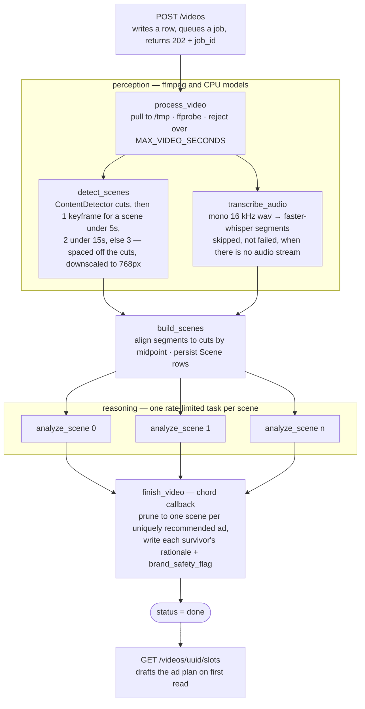
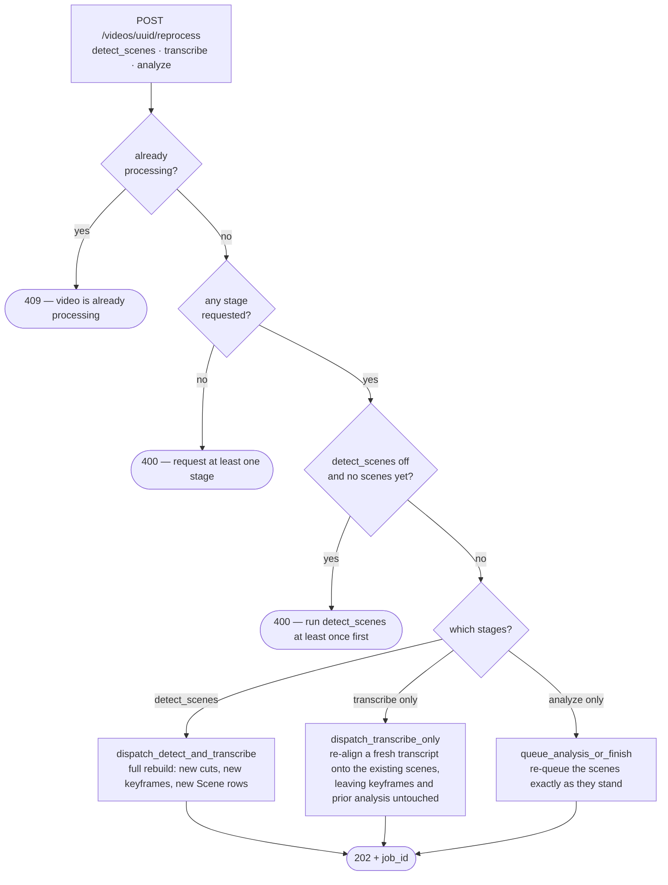
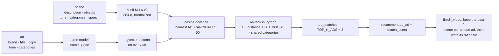
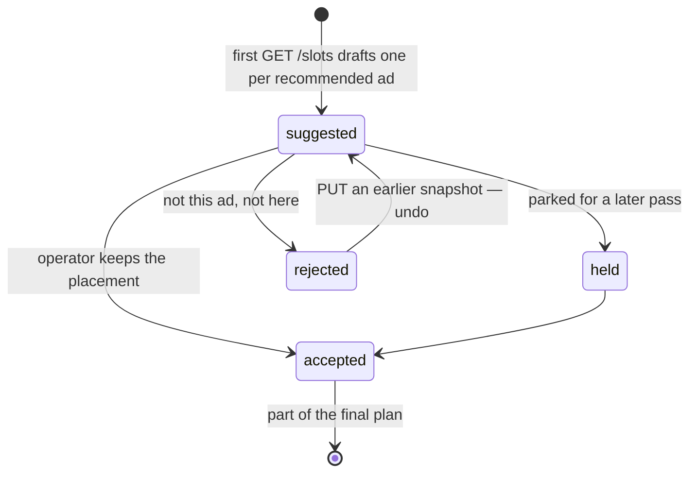

# Context-Aware Ad Recommender — backend

A JSON REST API that ingests a video, understands each scene (visuals, speech, emotional
tone) and recommends which ad from a catalog to place at which timestamp — each with a
one-line generated rationale and a brand-safety flag. It then drafts an ad plan that the
client's timeline editor takes over.

The Next.js client is a separate origin and generates its types off `/schema`; the Django
admin is for inspecting data during development.

```
POST /videos ──► Celery ──► ffprobe ─► scene detection ─► keyframes ─┐
                                   └─► audio ─► whisper ────────────┤
                                                                     ▼
        Gemini tags ─► embed ─► pgvector match ─► prune ─► rationale + safety flag
                                                           │
                                                           ▼
                                 GET /videos/{uuid}/slots ─► the ad plan
```

In the usual terms: shot-boundary detection sets the unit of analysis, a vision-language
model tags each shot under a fixed IAB taxonomy with JSON-schema-constrained decoding, and
a 384-d bi-encoder puts scenes and ads in one embedding space. Ranking is two-stage —
pgvector ANN recall, then a hybrid re-rank fusing cosine similarity with taxonomy overlap.
A second model call writes the rationale and the safety verdict, so a placement can be
audited in one read rather than trusted as a score. Nothing auto-publishes: every slot
starts as `suggested` and the operator's edits win from then on.

## Requirements

- [uv](https://docs.astral.sh/uv/) — manages Python 3.12 for you
- Docker — Postgres (pgvector) and Redis
- ffmpeg — `brew install ffmpeg`
- A Gemini API key — https://aistudio.google.com/apikey

## Setup

```bash
uv sync
cp .env.example .env          # then put your GEMINI_API_KEY in it
docker compose up -d          # postgres :5433, redis :6380 (redis is always needed)
uv run manage.py migrate
uv run manage.py seed_ads     # 12 ads, embedded locally
uv run manage.py createsuperuser   # optional, for /admin
```

Two terminals:

```bash
uv run manage.py runserver                  # API on :8000
uv run celery -A config worker -l info      # all heavy work happens here
```

Ports are 5433/6380 rather than the defaults because 5432/6379 were already in use on the
development machine. Change `docker-compose.yml` and `DATABASE_URL`/`REDIS_URL` to suit.

## Docker (development)

`docker/nonprod/` builds a dev container you attach to and work inside — it does not
supervise the app. Postgres and Redis stay in the root `docker-compose.yml`, which also
owns the network the dev container joins, so bring that up first:

```bash
docker compose up -d                                            # postgres + redis
export USER=$USER                                               # the build needs it
docker compose -f docker/nonprod/docker-compose.yaml up -d --build
docker compose -f docker/nonprod/docker-compose.yaml exec context_ai_django zsh
```

Inside the container:

```bash
uv run manage.py migrate
uv run manage.py seed_ads
uv run manage.py runserver 0.0.0.0:8000     # reachable on the host at :8022
uv run celery -A config worker -l info      # in a second shell
```

The image is `python:3.13-slim` while local development stays on 3.12 —
`requires-python` spans both and `uv.lock` covers them. Notes on the setup:

- The repo is bind-mounted at `/backend`, so dependencies install into `/usr/local`
  rather than `.venv`; a container venv would collide with the host's macOS one.
- `UV_PYTHON=3.13` overrides the bind-mounted `.python-version` (3.12), which would
  otherwise make uv fetch a second interpreter inside the container.
- Model weights live on the `model_cache` volume so whisper and sentence-transformers
  do not re-download on every rebuild.
- torch is pinned to the CPU wheel on linux (`[tool.uv.sources]` in `pyproject.toml`).
  The default CUDA build adds ~1.3GB of nvidia packages that nothing here can use.
- `CELERY_WORKER_POOL=prefork` — the threads pool is only needed on macOS.
- `DATABASE_URL`/`REDIS_URL` are overridden to `db:5432`/`redis:6379`; the values in
  `.env` are host ports and do not resolve inside the network.

## Database

`DATABASE_URL` picks the database; nothing else changes. Production points at Supabase
(session pooler, port 5432) — pgvector ships enabled there, in the `public` schema, so
the initial migration applies as-is.

The transaction pooler (port 6543) also works: settings detect it and disable prepared
statements and server-side cursors, which a multiplexing pooler cannot support.
`CONN_MAX_AGE=60` keeps connections alive, since a managed database is a TLS round-trip
away rather than on localhost.

**`manage.py test` always uses a local database**, never `DATABASE_URL`. The test runner
CREATEs and DROPs an entire database, which should not happen on managed infrastructure —
and behind a pooler the DROP fails outright, because the pooler keeps a session open and
Postgres refuses with *"database is being accessed by other users"*. Override with
`TEST_DATABASE_URL` if you need somewhere else.

The bundled Postgres container still exists for anyone who wants it:

```bash
docker compose -f docker/prod/docker-compose.yaml --env-file .env.prod --profile localdb up -d
```

## Production

Deploying to a host: see **[DEPLOY.md](DEPLOY.md)** for Oracle Cloud Always Free, which
runs web, worker and Redis on one free ARM VM alongside Supabase and R2.

```bash
cp .env.prod.example .env.prod        # fill in SECRET_KEY, POSTGRES_PASSWORD, GEMINI_API_KEY, R2_*
docker compose -f docker/prod/docker-compose.yaml --env-file .env.prod up -d --build
docker compose -f docker/prod/docker-compose.yaml --env-file .env.prod exec web python manage.py migrate
docker compose -f docker/prod/docker-compose.yaml --env-file .env.prod exec web python manage.py seed_ads
docker compose -f docker/prod/docker-compose.yaml --env-file .env.prod exec web python manage.py createsuperuser
```

`--env-file` is not optional: compose reads `env_file:` only when passing variables *into*
a container, never for `${VAR}` in the compose file itself. Without it `POSTGRES_PASSWORD`
is empty, so the flag is enforced — compose refuses to start rather than silently building
a blank-password database.

web and worker share one image (`context-ai-backend:prod`, ~5.5GB, mostly torch) with the
worker overriding the command. Model weights are baked in at `/opt/models`, so the first
video after a deploy does not stall on a 230MB HuggingFace download. The worker runs
`--concurrency=1` because `SCENE_ANALYSIS_RATE` is enforced per worker.

Settings refuse to boot when they would be unsafe:

```
DEBUG=False and no SECRET_KEY   -> ImproperlyConfigured
DEBUG=False and ALLOWED_HOSTS=* -> ImproperlyConfigured
manage.py check --deploy        -> clean (security.W003 silenced, see settings.py)
```

**Storage.** Production runs `STORAGE_BACKEND=r2`: the web container writes the upload,
the worker reads it back, and keyframes are handed to clients as presigned URLs, so the
two never need a shared filesystem. `local` still works for a single-host deployment
because web and worker share a `media` volume, but nothing beyond one host.

Verify the storage config before trusting a deploy — this writes, reads, presigns,
fetches anonymously over HTTPS and deletes a small object:

```bash
docker compose -f docker/prod/docker-compose.yaml --env-file .env.prod exec web \
  python manage.py check_storage
```

The anonymous fetch is the point: that is exactly how the frontend loads keyframes, and
it catches a wrong endpoint, a token scoped to the wrong bucket, or missing write
permission for the cost of a 24-byte object rather than a 100MB upload.

`R2_ENDPOINT_URL` is the **account** endpoint with no bucket path — django-storages
appends the bucket, so pasting Cloudflare's full S3 API string verbatim yields
`.../context-ai-bucket/context-ai-bucket/key` and every request 404s.

TLS terminates upstream (Cloudflare Tunnel, Caddy, whatever): `SECURE_PROXY_SSL_HEADER`
trusts `X-Forwarded-Proto`, so put it behind a proxy that sets it.

## The sample: Meridian

[Meridian](http://download.opencontent.netflix.com/) is a 12-minute film-noir short that
Netflix publishes as Open Content under CC BY 4.0 — real cuts, real mood shifts, and a
stable URL, so the demo never depends on YouTube. Its MP4 is 851 MB of 4K HDR and,
worth knowing, **has no audio track** (the Atmos audio ships as separate files), so
transcripts come back empty and the recommendations rest on visuals alone.

One command — download, register, process:

```bash
uv run manage.py fetch_sample --trim 120 --process
curl localhost:8000/videos/<uuid>/status
curl localhost:8000/videos/<uuid>/scenes
```

`--trim 120` registers only the opening two minutes (stream copy, no re-encode). The full
12 minutes is roughly 200 scenes, so ~400 Gemini calls — see [Gemini quota](#gemini-quota)
before running it, and raise `MAX_VIDEO_SECONDS` to 900 since the default cap is 300.

Already downloaded it, or want a different video?

```bash
uv run manage.py fetch_sample --path ~/Downloads/whatever.mp4 --process
```

Measured on the 2-minute excerpt: 25 scenes, 34 keyframes, 0 failures, about 11 minutes
end to end — nearly all of it waiting on the free-tier Gemini rate limit.

## Inspecting frame extraction

To see which frames the pipeline pulls, without a database, Celery or Gemini quota:

```bash
uv run manage.py preview_frames .samples/Meridian_UHD4k5994_HDR_P3PQ.mp4 --end 90
open frames_preview/
```

JPEGs are named `scene_frame_timestamp.jpg`. Useful for tuning `--threshold`; `--start`
and `--end` take seconds or `HH:MM:SS` and let you sample a window of a long file.

## API

| Method | Path | |
|---|---|---|
| GET | `/health` | liveness + DB probe — **public** |
| POST | `/login` | `Authorization: Basic base64(user:pass)` -> session cookie — **public** |
| GET, DELETE | `/login` | who am I / log out |
| POST | `/videos` | multipart `file` **or** JSON `source_url`; returns `202 {uuid, job_id}` |
| GET | `/videos` | the caller's videos, each with `file_url` |
| GET, DELETE | `/videos/{uuid}` | one video (same shape plus `file_url`) / drop it and its scenes |
| GET | `/videos/{uuid}/status` | `{status, scenes_done/scenes_total, scenes_failed, progress}` |
| GET | `/videos/{uuid}/scenes` | scenes with tags, keyframe URLs, recommended ad, rationale, safety flag |
| GET, PUT | `/videos/{uuid}/slots` | the ad plan — drafted on first read, then whole-list replace |
| POST | `/videos/{uuid}/reprocess` | re-run `detect_scenes` / `transcribe` / `analyze`, opt-in per stage |
| GET, POST | `/ads` | the catalog; `POST` may carry an `asset` file |
| GET, DELETE | `/ads/{id}` | one ad / remove it from the catalog |
| PUT | `/ads/{id}/asset` | replace the creative the editor previews |
| GET | `/tones` | tones already in use, for tagging an ad's `target_tone` |
| GET | `/schema` | OpenAPI 3.0.3 (YAML; `?format=json` for JSON) |
| GET | `/docs`, `/redoc` | Swagger UI / Redoc — **`DEBUG=True` only**, they are HTML |

Everything except `/health` and `POST /login` requires a session:

```bash
curl -c jar -X POST localhost:8000/login \
     -H "Authorization: Basic $(printf 'demo:demopass' | base64)"
curl -b jar localhost:8000/ads
```

```bash
curl -b jar -X POST localhost:8000/videos -F file=@clip.mp4
curl -X POST localhost:8000/videos -H 'Content-Type: application/json' \
     -d '{"source_url":"https://example.com/clip.mp4"}'
```

Generate a typed client from the schema:

```bash
curl localhost:8000/schema -o openapi.yaml
npx openapi-typescript openapi.yaml -o src/api.d.ts
```

CI can hold the docs honest — this fails on any undocumented or mis-documented operation:

```bash
uv run manage.py spectacular --validate --fail-on-warn --file /dev/null
```

## Authentication and CORS

Same shape as `certifier_reloaded_backend`: DRF `SessionAuthentication`, a global
`APIAuthenticationPermission` that makes every endpoint private by default, and views
opting out with a class attribute:

```python
class HealthAV(APIView):
    authentication = False              # whole view is public

class LoginAV(APIView):
    authentication = {"post": False}    # only POST is public
```

A new endpoint is therefore authenticated unless it says otherwise — which matters here,
because `POST /videos` spends Gemini quota.

Log in by POSTing base64 `username:password` in an `Authorization: Basic` header; Django
sets a session cookie. `DisableCSRFMiddleware` exempts the API from CSRF, which a
cross-origin client cannot satisfy — safe because the API is JSON-only.

The session cookie is `SameSite=None; Secure` so the client origin can hold it, so
**over plain-http localhost you need `SESSION_COOKIE_SECURE=False`** or the browser
silently drops it. CORS defaults to allow-all for development; set
`CORS_ALLOW_ALL_ORIGINS=False` and `CORS_ALLOWED_ORIGINS` before deploying.

## Pipeline

Views never touch ffmpeg or Gemini; everything below runs in a worker.



Each `analyze_scene` does the same three things: keyframes and transcript to Gemini for
`{description, objects, tone, iab_categories}`, then an embedding of that, then a pgvector
lookup over the ad catalog boosted by shared IAB categories. Any task raising marks the
video `failed` with the exception on the row.

The rationale is written in `finish_video`, not in `analyze_scene`, because many scenes
rank the same ad top. Pruning first — best-fit scene per unique ad, and scenes that matched
nothing are dropped along with their keyframes — spreads the plan across the timeline and
halves the Gemini spend, since the second call only runs on survivors. `GET /scenes` is
therefore often shorter than `scenes_total`.

`POST /reprocess` re-enters this graph partway — which entry point depends on the stages
asked for:



`scenes_done` counts *attempts*, incremented with `F()` so concurrent tasks cannot lose
one. A scene that hits a rate limit is re-queued; one that fails for any other reason is
logged and left untagged rather than stranding the chord, and `scenes_failed` on the
status endpoint reports how many ended that way.

## Ad catalog and matching

```bash
uv run manage.py seed_ads --replace
```

Each ad is embedded locally with sentence-transformers. Ads created through `POST /ads`
are embedded by a worker task; an ad without an embedding is never matched.



Gemini is restricted to a fixed IAB vocabulary (`core/gemini.py`). With free-form
categories, scene and ad categories would essentially never coincide and `IAB_BOOST`
would be dead weight. Ranking is cosine similarity plus `IAB_BOOST` per shared category,
so a slightly more distant ad in the right category beats a closer one in the wrong one.

## The ad plan

The pipeline recommends an ad per scene; the editor works in **slots**. `GET /videos/{uuid}/slots`
bridges the two exactly once — one `suggested` slot per scene that has a recommended ad, at
the scene's start, in the overlay lane if the ad is an overlay, and classed `pre_roll` /
`mid_roll` / `post_roll` by where it falls (the outer 5% of the runtime counts as an edge).

After that first read the slot list is the operator's document. `PUT` replaces the whole
list, so one endpoint covers adding, moving, editing, removing and undo — a `PUT` of an
earlier snapshot. An explicit plan, even an empty one, is never overwritten by a redraft;
`slots_seeded` is what makes deletions stick, since a deleted slot leaves no row behind for
an "are there slots?" check to notice.

An overlay's position is stored as `{"x","y","w","h"}` fractions of the frame rather than
pixels, so a box dragged against a 720p preview still lands right at 4K. It is validated
server-side — the values arrive straight from a drag in a browser, and a `JSONField` takes
whatever it is handed.



Those transitions are the editor's, not the server's: a `PUT` may set any state on any
slot, and the API only checks that the slot itself is valid — positive duration, a
non-negative timecode, a scene belonging to this video, an overlay box inside the frame.

Ads carry a creative: `ad_type` is `video` or `overlay`, and `asset_key` points at the file
the editor previews. `seed_ads` generates a placeholder clip or frame per ad with ffmpeg,
colored per brand, so the editor has something to render without real creative.

## Storage

`STORAGE_BACKEND=local` (default) writes under `MEDIA_ROOT`, served at `/media/` while
`DEBUG=True`. `STORAGE_BACKEND=r2` switches to Cloudflare R2 and hands out presigned
URLs; set `R2_BUCKET`, `R2_ACCESS_KEY_ID`, `R2_SECRET_ACCESS_KEY`, `R2_ENDPOINT_URL`.
Nothing else changes — the pipeline always pulls objects to a local temp path first.

## Gemini quota

Free-tier limits are the main brake on a long video. The default model
`gemini-flash-lite-latest` allows **15 requests per minute**, and at two calls per scene
`SCENE_ANALYSIS_RATE=4/m` leaves headroom for retries — which spend the same budget, so
running closer to the cap cascades into 429s. `gemini-flash-latest` is better at vision
but currently resolves to a model with a **20 requests per day** free tier.

On a paid key, raise `SCENE_ANALYSIS_RATE` and the whole thing gets much faster.

## Configuration

Everything is env-driven via `django-environ`; see `.env.example`.

| Variable | Default | |
|---|---|---|
| `MAX_VIDEO_SECONDS` | `300` | longer uploads are rejected |
| `SCENE_THRESHOLD` | `27.0` | ContentDetector sensitivity; lower cuts more |
| `WHISPER_MODEL` | `base` | `tiny` is much faster and much worse |
| `GEMINI_MODEL` | `gemini-flash-lite-latest` | |
| `SCENE_ANALYSIS_RATE` | `4/m` | scenes per minute |
| `TOP_K_ADS` / `IAB_BOOST` | `3` / `0.15` | ranking |
| `AD_CANDIDATES` | `50` | pulled by vector distance, then re-ranked in Python |
| `GEMINI_RETRIES` / `SCENE_RETRIES` | `5` / `3` | SDK backoff attempts, then task re-queues |
| `EMBEDDING_MODEL` / `EMBEDDING_DIM` | MiniLM-L6-v2 / `384` | must agree, or migrations reject the vectors |
| `EMBEDDING_DEVICE` | `cpu` | see below |
| `STORAGE_BACKEND` | `local` | or `r2`; `local` needs web and worker on one host |
| `TMP_CACHE_HOURS` | `6` | age at which stranded video pulls get swept |

## Running on macOS

Two platform quirks, both handled in settings, both worth knowing about:

- The Celery worker uses the **threads** pool on Darwin. A forked child that loads torch
  aborts — the Objective-C and OpenMP runtimes are not fork-safe.
- `EMBEDDING_DEVICE` defaults to **cpu**. sentence-transformers otherwise selects MPS,
  and torch's Metal kernels segfault when several worker threads drive them.

You will also see an `objc[...] Class AVFFrameReceiver is implemented in both` warning:
OpenCV and PyAV each bundle their own `libavdevice`. It is noise, not a fault.

## Tests

```bash
uv run manage.py test
```

84 tests. The ffmpeg ones build real clips and probe them; the Gemini ones are mocked, so
the suite costs no quota and needs no API key.

## Layout

```
config/        settings, celery app, root urls
core/
  models.py       Video, Scene, Ad, Tone, AdSlot
  tasks.py        the Celery pipeline
  media.py        ffprobe / scenedetect / keyframes / whisper — pure functions, local paths
  gemini.py       scene analysis + rationale, and the IAB vocabulary
  embeddings.py   local sentence-transformers
  matching.py     pgvector similarity + IAB boost, and the per-ad dedupe
  slots.py        recommendations -> the first draft of the ad plan
  storage.py      store / pull_to_tmp / delete / download
  serializers.py  DRF shapes, including the overlay-box validation
  permissions.py  authenticated-by-default session auth
  views.py        DRF viewsets
  management/commands/   seed_ads, fetch_sample, preview_frames, check_storage
```
